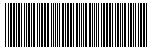

# PHP - Código de barras

Um estudo de caso sobre a renderização das regras para código de barras

Códigos de barras são estruturas de dados utilizadas para identificação de produtos e processos ao redor do mundo. Permitem a padronização das informações a respeito do que é transportado. Existem diversos modelos, neste estudo de caso o código Code39 é utilizado como referência, pois além permitir valores alfanuméricos, é de fácil interpretação.

## Como usar

- utilize o método *encode* da classe *Code39* para transformar o valor passado como argumento em um conjunto de dados binários;
- Utilize a função *draw* da classe *BarCode* para transoformar o binário obtido no passo anterior em um *resource*. A função *draw* recebe três parâmetros:
  - O código em binário do código de barras;
  - tipo do código de barras:
    - gif;
    - png;
    - jpeg;
  - tipo de saída: se o valor for *true* a imagem gerada será convertida para base64, senão um *resource* será devolvido.

```PHP
use App\{Code39, BarCode};

$text = "123456789";
$type = BarCode::GIF;

$codeBar = (new Code39)->encode($text);

$content = (new BarCode)->draw($codeBar, $type, false);

file_put_contents(__DIR__ . "\\sample.gif", $content);

```

### Código gerado através do snipet anterior



## Referências

[gs1br](https://www.gs1br.org/educacao-e-eventos/MateriaisTecnicos/Encarte%20T%C3%A9cnico%20GS1-128.pdf)

[keyence](https://www.keyence.com.br/ss/products/auto_id/barcode_lecture/basic/itf/)
